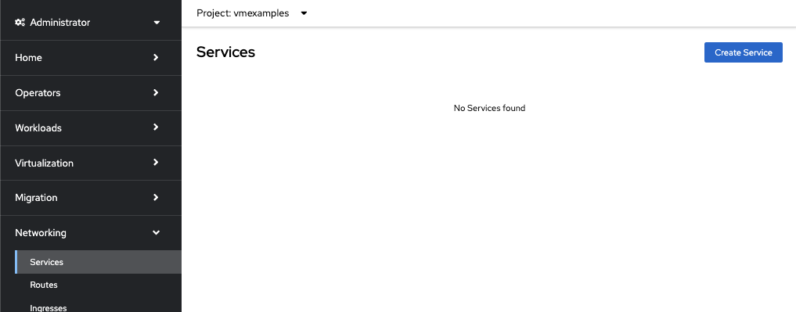
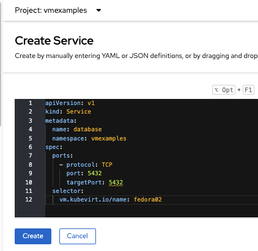
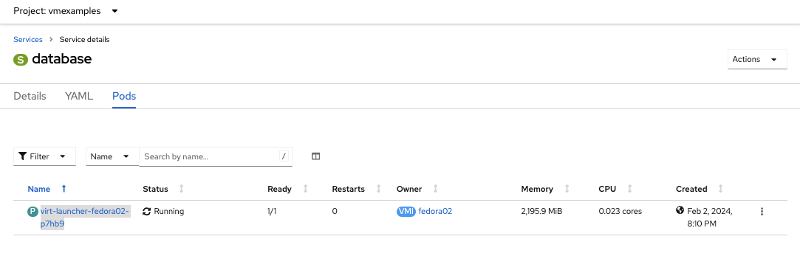
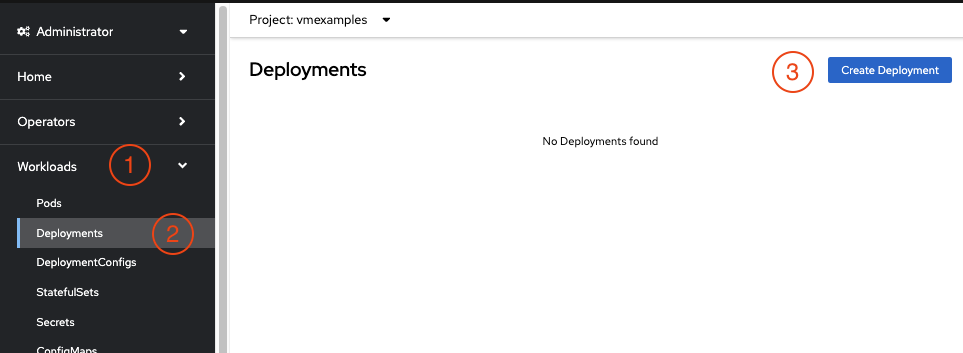
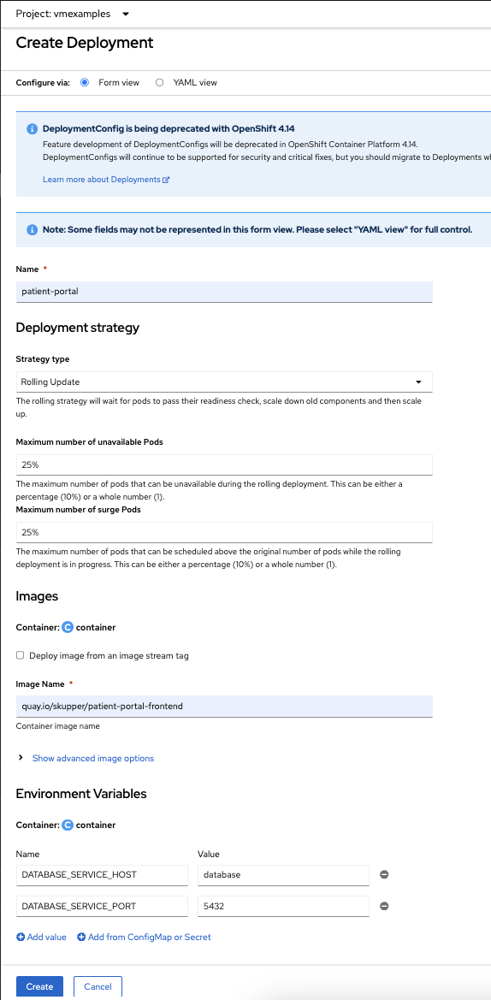
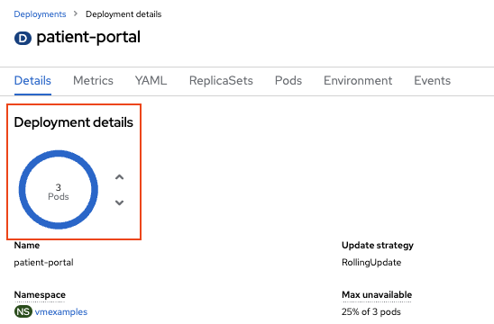
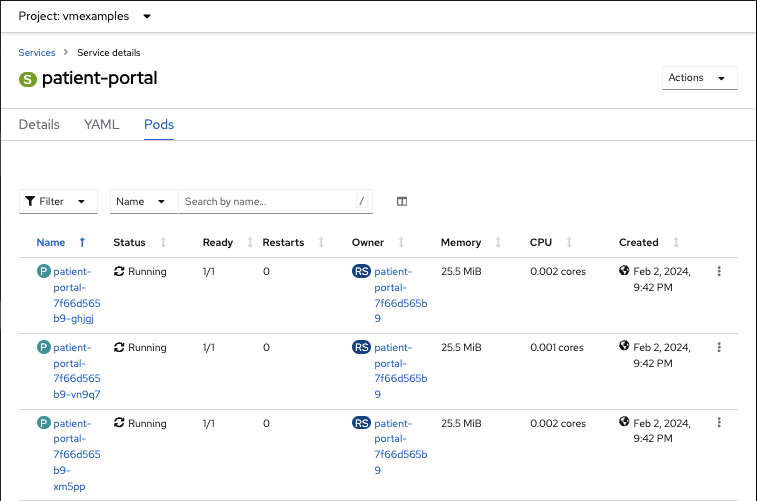
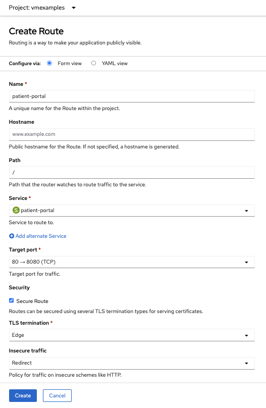
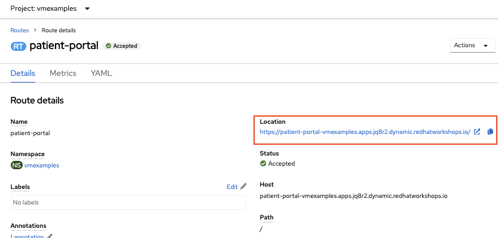

:scrollbar:
:toc2:

= Run Containers next to VM

:numbered:

In this lab, we will explore how you can run both VM and Containers side by side in a namespace and utilize the services running inside the VM by the pods. 

.Goals
* Create OpenShift services exposing services in a VM
* Connect a containerized application to the VM using the OpenShift Service.

== Create Database Service

You have already created a Fedora VM in the previous lab. This time you will expose the service running inside the VM to the pods running in the cluster.

. In the left menu, select *Networking* -> *Services* and click *Create*
+

+
Paste the following service definition to the window.
+
[source,yaml]
----
apiVersion: v1
kind: Service
metadata:
  name: database
  namespace: vmexamples
spec:
  ports:
    - protocol: TCP
      port: 5432
      targetPort: 5432
  selector:
    vm.kubevirt.io/name: fedora02
----
+
You can see that the `selector:` is set to `vm.kubevirt.io/name: fedora02` which specifies which pod to select. In our case it will select the pod containing the VM, which already has this label automatically applied during the VM creation.
+
 
+
Once done click on *Create*

. Ensure the Service is pointing to the right VM Pod by clicking on *Pods*. It should show the `fedora02` vm pod similar to `virt-launcher-fedora02-xxxxx`
+

== Create the Patient Portal

Now that you have setup the Database service, let us create the frontend application which will interact with our DB service running inside the VM

. In the left menu, select *Workloads* -> *Deployments*, then click *Create Deployment*
+

. In the create window set the following parameters
+
.. Specify the *Name* as `patient-portal`
.. Set *Image Name* as `quay.io/skupper/patient-portal-frontend`
.. Add two environment variables. This will help the portal application to locate its database.
... `DATABASE_SERVICE_HOST` to `database` -> This is the service name we created above.
... `DATABASE_SERVICE_PORT` to `5432` -> This is the port exposed by the service.
+

+
Once done, click *Create*

. Observe the pod count. There should be 3 pods and the ring should be *blue*. 
+

== Create Service for the portal
Similar to the service we created for the datbase VM, create a service for the portal, but with different port parameters. 

. Once again, from the left menu select *Networking* -> *Services*. Then click *Create Service* (Select *Form View* if not selected already)
. Paste the following yaml into the window, replacing it's content.
+
[source,yaml]
----
apiVersion: v1
kind: Service
metadata:
  name: patient-portal
  namespace: vmexamples
spec:
  ports:
    - protocol: TCP
      port: 80
      targetPort: 8080
  selector:
    app: patient-portal
----
+
Click *Create*
. Ensure the correct pods are listed in *Pods* tab of the service
+

. Expose the portal to external world using routes. From left menu select *Neworking* -> *Routes* then click *Create Route*
. Fillup the form using the values below
.. Set *Name* to `patient-portal`
.. Select `patient-portal` from the *Services* drop down menu
.. Select `80 -> 8080` from the *Target port* drop down menu
.. Check *Secure Route* 
... Set *TLS Terminiation* to `Edge`
... Set *Insecure Traffic* to `Redirect`
+

+
Once done click *Create*
. Verify if the route is active by clicking on the link  link:https://patient-portal-vmexamples.apps.%guid%.dynamic.redhatworkshops.io/[https://patient-portal-vmexamples.apps.%guid%.dynamic.redhatworkshops.io/] in the `patient-portal` route's details page.
+

